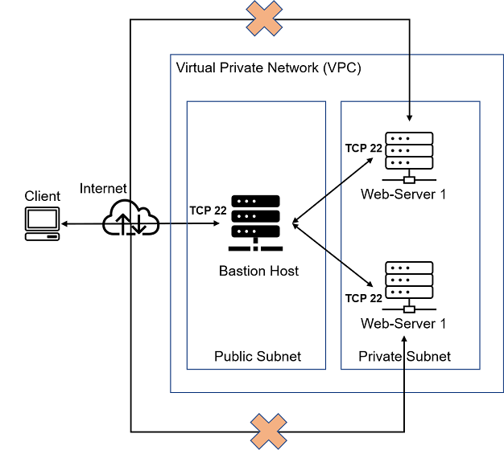
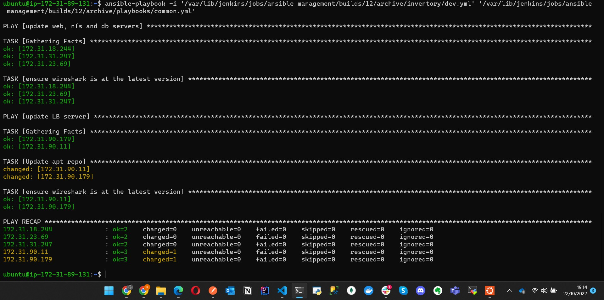

# ansible-config-mgt



# Step 1 - INSTALL AND CONFIGURE ANSIBLE ON EC2 INSTANCE
- Update Name tag on your Jenkins EC2 Instance to _Jenkins-Ansible_. We will use this server to run playbooks.

- In your GitHub account create a new repository and name it _ansible-config-mgt_.

- Install Ansible
`sudo apt update`

`sudo apt install ansible`

- Check your Ansible version by running `ansible --version`


- Configure Jenkins build job to save your repository content every time you change it – this will solidify your Jenkins configuration skills acquired in Project 9.

- Create a new Freestyle project ansible in Jenkins and point it to your ‘ansible-config-mgt’ repository.

- Configure Webhook in GitHub and set webhook to trigger ansible build.

- Configure a Post-build job to save all (**) files, like you did it in Project 9.

- Test your setup by making some change in README.MD file in master branch and make sure that builds starts automatically and Jenkins saves the files (build artifacts) in following folder

`ls /var/lib/jenkins/jobs/ansible/builds/<build_number>/archive/`

Note: Trigger Jenkins project execution only for /main (master) branch.


Now your setup will look like this:


- Tip Every time you stop/start your Jenkins-Ansible server – you have to reconfigure GitHub webhook to a new IP address, in order to avoid it, it makes sense to allocate an Elastic IP to your Jenkins-Ansible server (you have done it before to your LB server in Project 10). Note that Elastic IP is free only when it is being allocated to an EC2 Instance, so do not forget to release Elastic IP once you terminate your EC2 Instance.

# Step 2 – Prepare your development environment using Visual Studio Code
- After you have successfully installed VSC, configure it to connect to your newly created GitHub repository.

- Clone down your ansible-config-mgt repo to your Jenkins-Ansible instance

- download remote development pack from the extensions library.

`git clone <ansible-config-mgt repo link>`


# Step 3 - BEGIN ANSIBLE DEVELOPMENT
- In your ansible-config-mgt GitHub repository, create a new branch that will be used for development of a new feature.
Tip: Give your branches descriptive and comprehensive names, for example, if you use Jira or Trello as a project management tool – include ticket number (e.g. PRJ-145) in the name of your branch and add a topic and a brief description what this branch is about – a bugfix, hotfix, feature, release (e.g. feature/prj-145-lvm)

- Checkout the newly created feature branch to your local machine and start building your code and directory structure
- Create a directory and name it playbooks – it will be used to store all your playbook files.
- Create a directory and name it inventory – it will be used to keep your hosts organized.
- Within the playbooks folder, create your first playbook, and name it common.yml
- Within the inventory folder, create an inventory file (.yml) for each environment (Development, Staging Testing and Production) dev, staging, uat, and prod respectively.


# Step 4 – Set up an Ansible Inventory
- An Ansible inventory file defines the hosts and groups of hosts upon which commands, modules, and tasks in a playbook operate. Since our intention is to execute Linux commands on remote hosts, and ensure that it is the intended configuration on a particular server that occurs. It is important to have a way to organize our hosts in such an Inventory.

- Save below inventory structure in the inventory/dev file to start configuring your development servers. Ensure to replace the IP addresses according to your own setup.

Note: Ansible uses TCP port 22 by default, which means it needs to ssh into target servers from Jenkins-Ansible host – for this you can implement the concept of ssh-agent. Now you need to import your key into ssh-agent:

- To learn how to setup SSH agent and connect VS Code to your Jenkins-Ansible instance, please see this video:

[ssh agent for windows](https://youtu.be/OplGrY74qog)
[ssh agent for linux](https://youtu.be/OplGrY74qog)

`eval ssh-agent -s`
`ssh-add <path-to-private-key>`

- Confirm the key has been added with the command below, you should see the name of your key

`ssh-add -l`

- Now, ssh into your Jenkins-Ansible server using ssh-agent

`ssh -A ubuntu@public-ip`

Also notice, that your Load Balancer user is `ubuntu` and user for RHEL-based servers is `ec2-user`.

- Update your inventory/dev.yml file with this snippet of code:

```
[nfs]
<NFS-Server-Private-IP-Address> ansible_ssh_user='ec2-user'

[webservers]
<Web-Server1-Private-IP-Address> ansible_ssh_user='ec2-user'
<Web-Server2-Private-IP-Address> ansible_ssh_user='ec2-user'

[db]
<Database-Private-IP-Address> ansible_ssh_user='ec2-user' 

[lb]
<Load-Balancer-Private-IP-Address> ansible_ssh_user='ubuntu'
```

# Step 5 – Create a Common Playbook
It is time to start giving Ansible the instructions on what you need to be performed on all servers listed in inventory/dev.

In common.yml playbook you will write configuration for repeatable, re-usable, and multi-machine tasks that is common to systems within the infrastructure.

- Update your playbooks/common.yml file with following code:

```
---
- name: update web, nfs and db servers
  hosts: webservers, nfs, db
  remote_user: ec2-user
  become: yes
  become_user: root
  tasks:
    - name: ensure wireshark is at the latest version
      yum:
        name: wireshark
        state: latest

- name: update LB server
  hosts: lb
  remote_user: ubuntu
  become: yes
  become_user: root
  tasks:
    - name: Update apt repo
      apt: 
        update_cache: yes

    - name: ensure wireshark is at the latest version
      apt:
        name: wireshark
        state: latest
```
- Examine the code above and try to make sense out of it. This playbook is divided into two parts, each of them is intended to perform the same task: install wireshark utility (or make sure it is updated to the latest version) on your RHEL 8 and Ubuntu servers. It uses root user to perform this task and respective package manager: yum for RHEL 8 and apt for Ubuntu.

- Feel free to update this playbook with following tasks:

- Create a directory and a file inside it
**Change timezone on all servers**
**Run some shell script**

- For a better understanding of Ansible playbooks – [watch this video from RedHat](https://youtu.be/ZAdJ7CdN7DY) and [read this article](https://www.redhat.com/en/topics/automation/what-is-an-ansible-playbook). 

# Step 6 – Update GIT with the latest code
Now all of your directories and files live on your machine and you need to push changes made locally to GitHub.

In many organisations there is a development rule that do not allow to deploy any code before it has been reviewed by an extra pair of eyes – it is also called "Four eyes principle".

#### Commit your code into GitHub:

use git commands to add, commit and push your branch to GitHub.
`git status`

`git add <selected files>`

`git commit -m "commit message"`

- Create a Pull request (PR)

**Wear a hat of another developer for a second, and act as a reviewer.**

**If the reviewer is happy with your new feature development, merge the code to the master branch.**

- Head back on your terminal, checkout from the feature branch into the master, and pull down the latest changes.

Once your code changes appear in master branch – Jenkins will do its job and save all the files (build artifacts) to `/var/lib/jenkins/jobs/ansible/builds/<build_number>/archive/` directory on Jenkins-Ansible server.


# Step 7 – Run first Ansible test
Now, it is time to execute ansible-playbook command and verify if your playbook actually works:

<!-- `cd ansible-config-mgt` -->

<!-- `ansible-playbook -i inventory/dev.yml playbooks/common.yml` -->

`ansible-playbook -i /var/lib/jenkins/jobs/ansible/builds/<build_number>/archive/inventory/dev.yml /var/lib/jenkins/jobs/ansible management/builds/<build_number>/archive/playbooks/common.yml`



- You can go to each of the servers and check if wireshark has been installed by running which wireshark or wireshark --version

Your updated with Ansible architecture now looks like this:


# Optional step – Repeat once again
- Update your ansible playbook with some new Ansible tasks and go through the full `checkout -> change codes -> commit -> PR -> merge -> build -> ansible-playbook` cycle again to see how easily you can manage a servers fleet of any size with just one command!

# PROJECT 12 Documentation
# ANSIBLE REFACTORING AND STATIC ASSIGNMENTS (IMPORTS AND ROLES)
In this project you will continue working with ansible-config-mgt repository and make some improvements of your code. Now you need to refactor your Ansible code, create assignments, and learn how to use the imports functionality. Imports allow to effectively re-use previously created playbooks in a new playbook – it allows you to organize your tasks and reuse them when needed.

Side Self Study: For better understanding or Ansible artifacts re-use – [read this article](https://docs.ansible.com/ansible/latest/user_guide/playbooks_reuse.html).

## Let us see how you can improve your Ansible code!

## Step 1 – Jenkins job enhancement
Before we begin, let us make some changes to our Jenkins job. 

Now every new change in the codes creates a separate directory which is not very convenient when we want to run some commands from one place. Besides, it consumes space on Jenkins serves with each subsequent change. Let us enhance it by introducing a new Jenkins project/job – we will require [Copy Artifact](https://plugins.jenkins.io/copyartifact/) plugin.

- Go to your Jenkins-Ansible server and create a new directory called ansible-config-artifact – we will store there all artifacts after each build.
`sudo mkdir /home/ubuntu/ansible-config-artifact`

- Change permissions to this directory, so Jenkins could save files there
`sudo chmod -R 0777 /home/ubuntu/ansible-config-artifact`

- Go to Jenkins web console -> Manage Jenkins -> Manage Plugins -> on Available tab search for Copy Artifact and install this plugin without restarting Jenkins


- Create a new Freestyle project (you have done it in Project 9) and name it *save_artifacts*.

- This project will be triggered by completion of your existing ansible project. Configure it accordingly:


Note: You can configure number of builds to keep in order to save space on the server, for example, you might want to keep only last 2 or 5 build results. You can also make this change to your ansible job.

- The main idea of save_artifacts project is to save artifacts into /home/ubuntu/ansible-config-artifact directory. To achieve this, create a Build step and choose Copy artifacts from other project, specify ansible as a source project and /home/ubuntu/ansible-config-artifact as a target directory.


- Test your set up by making some change in README.MD file inside your ansible-config-mgt repository (right inside master branch).

- If both Jenkins jobs have completed one after another – you shall see your files inside /home/ubuntu/ansible-config-artifact directory and it will be updated with every commit to your master branch.

Now your Jenkins pipeline is more neat and clean.


## Step 2 – Refactor Ansible code by importing other playbooks into site.yml
- Before starting to refactor the codes, ensure that you have pulled down the latest code from master (main) branch, and created a new branch, name it refactor.

- DevOps philosophy implies constant iterative improvement for better efficiency – refactoring is one of the techniques that can be used, but you always have an answer to question "why?". Why do we need to change something if it works well?

In Project 11 you wrote all tasks in a single playbook common.yml, now it is pretty simple set of instructions for only 2 types of OS, but imagine you have many more tasks and you need to apply this playbook to other servers with different requirements. In this case, you will have to read through theplaybook will  whole playbook to check if all tasks written there are applicable and is there anything that you need to add for certain server/OS families. Very fast it will become a tedious exercise and your become messy with many commented parts. Your DevOps colleagues will not appreciate such organization of your codes and it will be difficult for them to use your playbook.

Most Ansible users learn the one-file approach first. However, breaking tasks up into different files is an excellent way to organize complex sets of tasks and reuse them.

Let see code re-use in action by importing other playbooks.

- Within playbooks folder, create a new file and name it _site.yml_ – This file will now be considered as an entry point into the entire infrastructure configuration. Other playbooks will be included here as a reference. In other words, site.yml will become a parent to all other playbooks that will be developed. Including common.yml that you created previously. Don't worry, you will understand more what this means shortly.

- Create a new folder in root of the repository and name it static-assignments. The static-assignments folder is where all other children playbooks will be stored. This is merely for easy organization of your work. It is not an Ansible specific concept, therefore you can choose how you want to organize your work. You will see why the folder name has a prefix of static very soon. For now, just follow along.

- Move common.yml file into the newly created static-assignments folder.

- Inside site.yml file, import common.yml playbook.

```
---
- hosts: all
- import_playbook: ../static-assignments/common.yml
```

The code above uses built in import_playbook Ansible module.

Your folder structure should look like this;

```
├── static-assignments
│   └── common.yml
├── inventory
    └── dev
    └── stage
    └── uat
    └── prod
└── playbooks
    └── site.yml
```

- Run ansible-playbook command against the dev environment
Since you need to apply some tasks to your dev servers and wireshark is already installed – you can go ahead and create another playbook under static-assignments and name it common-del.yml. In this playbook, configure deletion of wireshark utility.

```
---
- name: update web, nfs and db servers
  hosts: webservers, nfs
  remote_user: ec2-user
  become: yes
  become_user: root
  tasks:
  - name: delete wireshark
    yum:
      name: wireshark
      state: removed

- name: update LB server
  hosts: lb, db
  remote_user: ubuntu
  become: yes
  become_user: root
  tasks:
  - name: delete wireshark
    apt:
      name: wireshark-qt
      state: absent
      autoremove: yes
      purge: yes
      autoclean: yes
```

update site.yml with 

`- import_playbook: ../static-assignments/common-del.yml`

instead of common.yml and run it against dev servers:

`'ansible-playbook -i /var/lib/jenkins/jobs/ansible management/builds/<build_number>/archive/inventory/dev.yml' '/var/lib/jenkins/jobs/ansible management/builds/<build_number>/archive/playbooks/site.yml'`


Make sure that wireshark is deleted on all the servers by running `wireshark --version`


Now you have learned how to use import_playbooks module and you have a ready solution to _install/delete_ packages on multiple servers with just one command.


## Step 3 – Configure UAT Webservers with a role ‘Webserver’
We have our nice and clean dev environment, so let us put it aside and configure 2 new Web Servers as uat. We could write tasks to configure Web Servers in the same playbook, but it would be too messy, instead, we will use a dedicated role to make our configuration reusable.

- Launch 2 fresh EC2 instances using RHEL 8 image, we will use them as our uat servers, so give them names accordingly – Web1-UAT and Web2-UAT.

- Tip: Do not forget to stop EC2 instances that you are not using at the moment to avoid paying extra. For now, you only need 2 new RHEL 8 servers as Web Servers and 1 existing Jenkins-Ansible server up and running.

- To create a role, you must create a directory called roles/, relative to the playbook file or in /etc/ansible/ directory.

- There are two ways how you can create this folder structure:

1. Use an Ansible utility called ansible-galaxy inside ansible-config-mgt/roles directory (you need to create roles directory upfront)

`mkdir roles`
`cd roles`
`ansible-galaxy init webserver`

- Create the directory/files structure manually

Note: You can choose either way, but since you store all your codes in GitHub, it is recommended to create folders and files there rather than locally on Jenkins-Ansible server.

The entire folder structure should look like below, but if you create it manually – you can skip creating tests, files, and vars or remove them if you used ansible-galaxy

```
└── webserver
    ├── README.md
    ├── defaults
    │   └── main.yml
    ├── files
    ├── handlers
    │   └── main.yml
    ├── meta
    │   └── main.yml
    ├── tasks
    │   └── main.yml
    ├── templates
    ├── tests
    │   ├── inventory
    │   └── test.yml
    └── vars
        └── main.yml
```

- After removing unnecessary directories and files, the roles structure should look like this

```
└── webserver
    ├── README.md
    ├── defaults
    │   └── main.yml
    ├── handlers
    │   └── main.yml
    ├── meta
    │   └── main.yml
    ├── tasks
    │   └── main.yml
    └── templates
```

- Update your inventory ansible-config-mgt/inventory/uat.yml file with IP addresses of your 2 UAT Web servers

NOTE: Ensure you are using ssh-agent to ssh into the Jenkins-Ansible instance just as you have done in project 11;

```
[uat-webservers]
<Web1-UAT-Server-Private-IP-Address> ansible_ssh_user='ec2-user' 

<Web2-UAT-Server-Private-IP-Address> ansible_ssh_user='ec2-user'
```

In /etc/ansible/ansible.cfg file uncomment roles_path string and provide a full path to your roles directory `roles_path    = /home/ubuntu/ansible-config-mgt/roles`, so Ansible could know where to find configured roles.


It is time to start adding some logic to the webserver role. Go into tasks directory, and within the main.yml file, start writing configuration tasks to do the following:

1. Install and configure Apache (httpd service)
2. Clone Tooling website from GitHub https://github.com/<your-name>/tooling.git.
3. Ensure the tooling website code is deployed to /var/www/html on each of 2 UAT Web servers.
4. Make sure httpd service is started

Your main.yml may consist of following tasks:

```
---
- name: install apache
  become: true
  ansible.builtin.yum:
    name: "httpd"
    state: present

- name: install git
  become: true
  ansible.builtin.yum:
    name: "git"
    state: present

- name: clone a repo
  become: true
  ansible.builtin.git:
    repo: https://github.com/<your-name>/tooling.git
    dest: /var/www/html
    force: yes

- name: copy html content to one level up
  become: true
  command: cp -r /var/www/html/html/ /var/www/

- name: Start service httpd, if not started
  become: true
  ansible.builtin.service:
    name: httpd
    state: started

- name: recursively remove /var/www/html/html/ directory
  become: true
  ansible.builtin.file:
    path: /var/www/html/html
    state: absent
```

## Step 4 – Reference ‘Webserver’ role
- Within the static-assignments folder, create a new assignment for uat-webservers uat-webservers.yml. This is where you will reference the role.

```
---
- hosts: uat-webservers
  roles:
     - webserver
```

- Remember that the entry point to our ansible configuration is the site.yml file. Therefore, you need to refer your uat-webservers.yml role inside site.yml.

So, we should have this in site.yml

```
---
- hosts: all
- import_playbook: ../static-assignments/common.yml

- hosts: uat-webservers
- import_playbook: ../static-assignments/uat-webservers.yml
```

## Step 5 – Commit & Test
- Commit your changes, create a Pull Request and merge them to master branch, make sure webhook triggered two consequent Jenkins jobs, they ran successfully and copied all the files to your Jenkins-Ansible server into /home/ubuntu/ansible-config-mgt/ directory.

- Now run the playbook against your uat inventory and see what happens:

`sudo ansible-playbook -i /home/ubuntu/ansible-config-mgt/inventory/uat.yml /home/ubuntu/ansible-config-mgt/playbooks/site.yml`

You should be able to see both of your UAT Web servers configured and you can try to reach them from your browser:

`http://<Web1-UAT-Server-Public-IP-or-Public-DNS-Name>/index.php`

or

`http://<Web2-UAT-Server-Public-IP-or-Public-DNS-Name>/index.php`


Your Ansible architecture now looks like this:


# PROJECT 13 Documentation

# Introducing Dynamic Assignment Into Our structure
- In your https://github.com/<your-name>/ansible-config-mgt GitHub repository start a new branch and call it dynamic-assignments.

- Create a new folder, name it dynamic-assignments. Then inside this folder, create a new file and name it env-vars.yml. We will instruct site.yml to include this playbook later. For now, let us keep building up the structure.

- Your GitHub shall have following structure by now.

---
├── dynamic-assignments
│   └── env-vars.yml
├── inventory
│   └── dev
    └── stage
    └── uat
    └── prod
└── playbooks
    └── site.yml
└── roles (optional folder)
    └──...(optional subfolders & files)
└── static-assignments
    └── common.yml
---

---
Note: Depending on what method you used in the previous project you may have or not have roles folder in your GitHub repository – if you used ansible-galaxy, then roles directory was only created on your Jenkins-Ansible server locally. It is recommended to have all the codes managed and tracked in GitHub, so you might want to recreate this structure manually in this case – it is up to you.
---

Since we will be using the same Ansible to configure multiple environments, and each of these environments will have certain unique attributes, such as servername, ip-address etc., we will need a way to set values to variables per specific environment.

- For this reason, we will now create a folder to keep each environment’s variables file. Therefore, create a new folder env-vars, then for each environment, create new YAML files which we will use to set variables.

Your layout should now look like this.

---
├── dynamic-assignments
│   └── env-vars.yml
├── env-vars
    └── dev.yml
    └── stage.yml
    └── uat.yml
    └── prod.yml
├── inventory
    └── dev
    └── stage
    └── uat
    └── prod
├── playbooks
    └── site.yml
└── static-assignments
    └── common.yml
    └── webservers.yml
---

- Now paste the instruction below into the env-vars.yml file.

```
---
- name: collate variables from env specific file, if it exists
  hosts: all
  tasks:
    - name: looping through list of available files
      include_vars: "{{ item }}"
      with_first_found:
        - files:
            - dev.yml
            - stage.yml
            - prod.yml
            - uat.yml
          paths:
            - "{{ playbook_dir }}/../env-vars"
      tags:
        - always
```

- Notice 3 things to notice here:

- We used include_vars syntax instead of include, this is because Ansible developers decided to separate different features of the module. From Ansible version 2.8, the include module is deprecated and variants of include_* must be used. These are:

```
include_role
include_tasks
include_vars
```

In the same version, variants of import were also introduced, such as:

```
import_role
import_tasks
```

- We made use of a special variables { playbook_dir } and { inventory_file }. { playbook_dir } will help Ansible to determine the location of the running playbook, and from there navigate to other path on the filesystem. { inventory_file } on the other hand will dynamically resolve to the name of the inventory file being used, then append .yml so that it picks up the required file within the env-vars folder.

- We are including the variables using a loop. with_first_found implies that, looping through the list of files, the first one found is used. This is good so that we can always set default values in case an environment specific env file does not exist.

## Update site.yml with dynamic assignments
- Update site.yml file to make use of the dynamic assignment. (At this point, we cannot test it yet. We are just setting the stage for what is yet to come. So hang on to your hats)

site.yml should now look like this.

```
---
- hosts: all
- name: Include dynamic variables 
  tasks:
  import_playbook: ../static-assignments/common.yml 
  include: ../dynamic-assignments/env-vars.yml
  tags:
    - always

-  hosts: webservers
- name: Webserver assignment
  import_playbook: ../static-assignments/webservers.yml
```

## Community Roles
Now it is time to create a role for MySQL database – it should install the MySQL package, create a database and configure users. But why should we re-invent the wheel? There are tons of roles that have already been developed by other open source engineers out there. These roles are actually production ready, and dynamic to accommodate most of Linux flavours. With Ansible Galaxy again, we can simply download a ready to use ansible role, and keep going.

### Download Mysql Ansible Role
- You can browse available community roles [here](https://galaxy.ansible.com/home)

- We will be using a [MySQL role developed by geerlingguy](https://galaxy.ansible.com/geerlingguy/mysql).

Hint: To preserve your your GitHub in actual state after you install a new role – make a commit and push to master your ‘ansible-config-mgt’ directory. Of course you must have git installed and configured on Jenkins-Ansible server and, for more convenient work with codes, you can configure Visual Studio Code to work with this directory. In this case, you will no longer need webhook and Jenkins jobs to update your codes on Jenkins-Ansible server, so you can disable it – we will be using Jenkins later for a better purpose.

- On Jenkins-Ansible server make sure that git is installed with git --version, then go to ‘ansible-config-mgt’ directory and run

```
git init
git pull https://github.com/<your-name>/ansible-config-mgt.git
git remote add origin https://github.com/<your-name>/ansible-config-mgt.git
git branch roles-feature
git switch roles-feature
```

- Inside roles directory create your new MySQL role with `ansible-galaxy install geerlingguy.mysql` and rename the folder to mysql

`mv geerlingguy.mysql/ mysql`

- Read README.md file, and edit roles configuration to use correct credentials for MySQL required for the tooling website.
Now it is time to upload the changes into your GitHub:

```
git add .
git commit -m "Commit new role files into GitHub"
git push --set-upstream origin roles-feature
Now, if you are satisfied with your codes, you can create a Pull Request and merge it to main branch on GitHub.
```